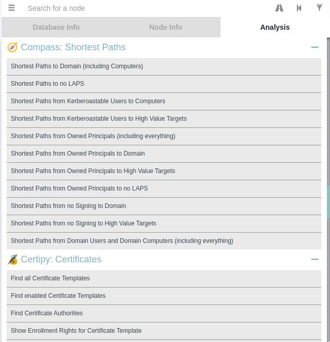

# BloodHound Custom Query Merger

## Introduction

This script merges various BloodHound custom queries together into one file
which can then be used on BloodHound.

The file contains the following BloodHound custom queries:

- Compass BloodHound Customqueries by [@CompassSecurity](https://github.com/CompassSecurity)
  - https://blog.compass-security.com/2020/07/make-the-most-out-of-bloodhound/
  - https://github.com/CompassSecurity/BloodHoundQueries/
- Certipy BloodHound Customqueries by [@ly4k](https://github.com/ly4k)
  - https://research.ifcr.dk/certipy-2-0-bloodhound-new-escalations-shadow-credentials-golden-certificates-and-more-34d1c26f0dc6
  - https://github.com/ly4k/Certipy
- Hausec BloodHound Customqueries by [@hausec](https://github.com/hausec)
  - https://hausec.com/2019/09/09/bloodhound-cypher-cheatsheet/
  - https://hausec.com/2020/11/23/azurehound-cypher-cheatsheet/
  - https://github.com/hausec/Bloodhound-Custom-Queries

## Prerequisites
To user the custom query downloader, please install jq first, e.g.:   
```bash
sudo apt install jq
```

## Usage

Download and various queries:
```bash
./bloodhound-customqueries-downloader
```

Install the queries:
```bash
cp customqueries.json ~/.config/bloodhound/customqueries.json
```

You will find the custom queries in BloodHound:



## Alternative

[Bloodhound Query Merger (bqm)](https://github.com/Acceis/bqm) is another tool that deduplicates custom BloudHound queries from different datasets (currently 12) and merge them in one customqueries.json file.
